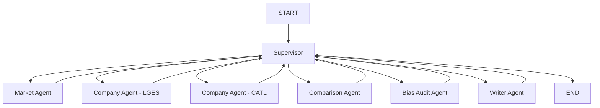

# Battery Strategy Multi-Agent System
전기차 캐즘 환경에서 LG에너지솔루션(LGES)과 CATL의 포트폴리오 다각화 전략을 비교 분석하는 Supervisor 기반 Multi-Agent 보고서 생성 시스템입니다.

## Overview
- Objective : EV 시장 둔화 속에서 LGES와 CATL의 전략 차이와 시사점을 자동 분석합니다.
- Method : LangGraph 기반 Supervisor Orchestration, Agentic RAG, Web Augmentation, Bias Audit
- Tools : Python, LangGraph, OpenAI API, FAISS, BM25, DuckDuckGo Search

## Features
- PDF 자료 기반 정보 추출 및 RAG 인덱싱
- 시장 분석, 기업 분석, 비교 분석, SWOT, 시사점 자동 생성
- Supervisor 중심의 그래프 기반 멀티 에이전트 실행
- 시장, LGES, CATL 분석 병렬 수행 후 비교 단계로 결합
- RAG 우선 수집 후 부족한 축만 웹 검색으로 보강
- 참고 근거 통합 및 하단 Reference 각주 번호화
- 확증 편향 방지 전략 : Search Balance Checker, Bias Audit, 부분 재시도

## Tech Stack

| Category   | Details |
|------------|---------|
| Framework  | LangGraph, LangChain-style orchestration, Python 3.11 |
| LLM        | OpenAI Responses API |
| Retrieval  | FAISS, BM25, RRF |
| Embedding  | BAAI/bge-m3 |
| Search     | DuckDuckGo Search, Trafilatura |
| Parsing    | pypdf |

## Agents
- Supervisor Agent: 전체 상태를 관리하고 다음 작업 노드를 결정합니다.
- Market Analysis Agent: 시장 배경, 수요 변화, 정책 및 공급망 이슈를 분석합니다.
- Company Analysis Agent: LGES와 CATL의 전략, 리스크, 기술, 생산 축을 분석합니다.
- Comparison Agent: 비교 매트릭스와 전략 차이를 정리합니다.
- Bias Audit Agent: 근거 부족, 편향, 과도한 해석 여부를 점검하고 재시도를 제안합니다.
- Writer Agent: 최종 보고서와 Reference를 생성합니다.

## Architecture



## Directory Structure

```text
├── data/                    # PDF 문서 및 원천 자료
├── configs/                 # 실행 설정 및 데이터 매니페스트
├── battery_strategy/agents/ # Supervisor 및 개별 Agent 모듈
├── battery_strategy/rag/    # PDF 로딩, 청킹, 임베딩, 검색
├── battery_strategy/tools/  # 프롬프트, 웹 검색, 밸런스 체크
├── outputs/                 # 분석 결과 및 보고서 저장
├── notebooks/               # 그래프 시각화 노트북
├── README.md                # 프로젝트 소개 문서
└── setup.md                 # 설치 및 실행 가이드
```

## Report Output
- 보고서 파일명 : `agent_{X반}_{이름1+이름2}.pdf`

## Contributors
- 이름1 : Prompt Engineering, Supervisor Graph Design, Bias Audit Logic
- 이름2 : PDF Parsing, Retrieval Pipeline, Web Search Augmentation

## Setup Guide
- 설치 및 실행 방법은 [setup.md](/Users/skax/Library/Mobile Documents/com~apple~CloudDocs/SKALA/RAG/battery-market-intelligence/setup.md) 에 정리되어 있습니다.
