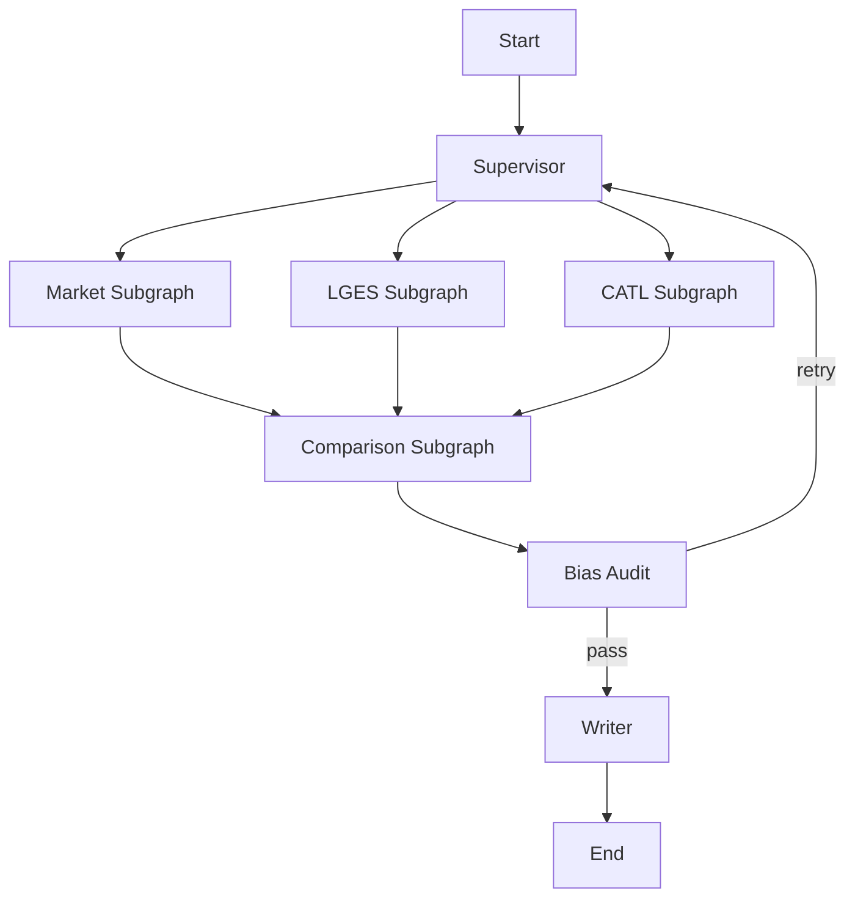

# 배터리 시장 전략 분석 Multi-Agent 시스템

전기차 캐즘 환경에서 LG에너지솔루션(LGES)과 CATL의 포트폴리오 다각화 전략을 비교 분석하는 Supervisor 기반 Multi-Agent 파이프라인입니다.

## Overview
- **Objective**: LGES와 CATL의 포트폴리오 다각화 전략을 시장 배경 → 기업별 전략 → 비교 → SWOT → 시사점 구조로 자동 분석
- **Method**: Supervisor Pattern + Subgraph, Agentic RAG, Web Search Balance Check, Bias Audit, Partial Retry
- **Tools**: Python 3.11, OpenAI API, BGE-M3, FAISS, BM25, DuckDuckGo Search

> **중요**: 임베딩/인덱싱은 분석 실행과 분리되어 있습니다. 먼저 `embed` 단계로 RAG 인덱스를 만들고, 그 다음 `run` 단계로 분석을 수행합니다.

## Features
- PDF 기반 RAG 코퍼스 구축
- 시장/기업/비교 단계 분리
- Supervisor 중심 상태 제어 및 부분 재실행
- Web Search 1차 편향 점검(Search Balance Checker)
- 최종 2차 편향 점검(Bias Audit Agent)
- 정량 metric 우선 추출 및 citation 추적
- Markdown 보고서 자동 생성

## Tech Stack

| Category | Details |
|---|---|
| Framework | Python 3.11, Typer CLI |
| LLM | OpenAI Responses API (configurable model) |
| Retrieval | FAISS (dense) + BM25 (sparse) + RRF |
| Embedding | BAAI/bge-m3 |
| Reranker | Optional: bge-reranker-v2-m3 via FlagEmbedding |
| Search | DuckDuckGo Search + Trafilatura |
| PDF Parsing | pypdf |

## Agents
- **Supervisor**: 전체 실행 흐름 제어, retry_plan 확정
- **Market Analysis Subgraph**: 시장 배경 분석
- **Company Analysis Subgraph**: LGES / CATL 전략 프로파일 생성
- **Comparison & SWOT Subgraph**: 비교 매트릭스 및 SWOT 생성
- **Bias Audit Agent**: 최종 편향/누락/최신성/충돌 점검
- **Writer & Reference Agent**: 최종 보고서 및 참고문헌 생성

## Architecture



## Directory Structure

```text
battery_strategy_multi_agent/
├── .python-version
├── pyproject.toml
├── README.md
├── .env.example
├── configs/
│   ├── data_manifest.yaml
│   └── runtime.example.yaml
├── data/
│   └── raw/
│       ├── MARKET.pdf
│       ├── LGES.pdf
│       └── CATL.pdf
├── battery_strategy/
│   ├── __init__.py
│   ├── cli.py
│   ├── pipeline.py
│   ├── agents/
│   │   ├── __init__.py
│   │   ├── runtime.py
│   │   ├── postprocess.py
│   │   ├── supervisor.py
│   │   ├── market.py
│   │   ├── company.py
│   │   ├── comparison.py
│   │   ├── bias_audit.py
│   │   └── writer.py
│   ├── rag/
│   │   ├── __init__.py
│   │   ├── pdf_loader.py
│   │   ├── chunking.py
│   │   ├── embedding.py
│   │   ├── index_store.py
│   │   └── retrieval.py
│   ├── tools/
│   │   ├── __init__.py
│   │   ├── llm.py
│   │   ├── web_search.py
│   │   ├── balance.py
│   │   ├── prompts.py
│   │   └── planning.py
│   └── utils/
│       ├── __init__.py
│       ├── settings.py
│       ├── types.py
│       └── common.py
├── tests/
│   └── test_smoke.py
└── outputs/
```

### Package Responsibilities
- `battery_strategy/agents`: Supervisor와 개별 분석 에이전트, 에이전트 공통 runtime/postprocess
- `battery_strategy/rag`: PDF 적재, 청킹, 임베딩, 인덱스 생성/로딩, 검색
- `battery_strategy/tools`: LLM, 웹 검색, 검색 편향 점검, 프롬프트, 질의 계획
- `battery_strategy/utils`: 공통 타입, 설정 로더, 범용 유틸리티

## Quick Start

### 1) 환경 변수 설정
```bash
cp .env.example .env
```

`.env`에 최소 아래 값을 채워주세요.

```bash
OPENAI_API_KEY=YOUR_API_KEY
OPENAI_MODEL=gpt-4.1-mini
```

### 2) 의존성 설치
```bash
uv sync
```

테스트 도구까지 포함해 개발 환경을 맞추려면 아래를 사용하세요.

```bash
uv sync --dev
```

### 3) RAG 인덱스 생성 (분리 실행)
```bash
uv run battery-strategy embed --config configs/runtime.example.yaml
```

### 4) 분석 실행
```bash
uv run battery-strategy run \
  --config configs/runtime.example.yaml \
  --goal "전기차 캐즘 여파 속 LGES와 CATL의 포트폴리오 다각화 전략 비교 분석"
```

### 5) 산출물 확인
- `outputs/final_report.md`
- `outputs/final_state.json`
- `outputs/references.txt`

### 6) 스모크 테스트
```bash
uv run pytest -q tests/test_smoke.py
```

## Runtime Config 예시
`configs/runtime.example.yaml`에서 아래 항목을 조정할 수 있습니다.
- 사용할 LLM 모델
- dense / sparse / final top-k
- web search on/off
- 최대 retry 횟수
- 출력 경로

## Data Sources
기본 코퍼스는 아래 3개 clipped PDF를 사용합니다.
- `MARKET.pdf`
- `LGES.pdf`
- `CATL.pdf`

각 문서의 메타데이터/참고문헌 형식은 `configs/data_manifest.yaml`에서 관리합니다.

## Notes
- 이 프로젝트는 **분석용 코드 베이스**이며, 제출용 보고서 PDF 생성은 별도 후처리로 확장 가능합니다.
- Web Search는 최신성 보강용이며, 기본 비교 근거는 RAG 문서를 우선합니다.
- BGE reranker는 optional dependency입니다.

## Contributors
> 실제 제출 시 팀원별 역할로 수정하세요.
- 이름1 : Supervisor / Prompt Engineering
- 이름2 : PDF Parsing / Retrieval / Web Search
