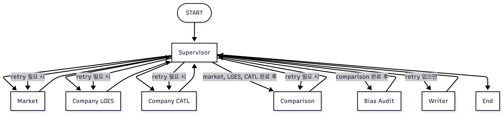
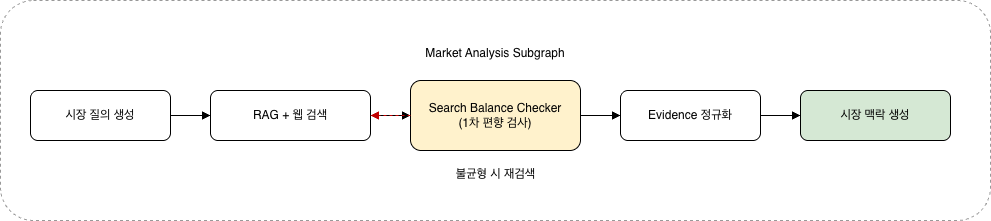
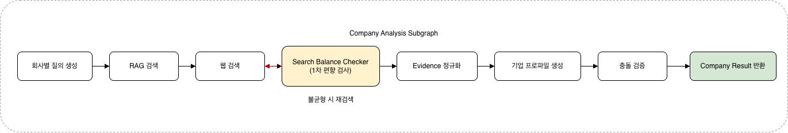
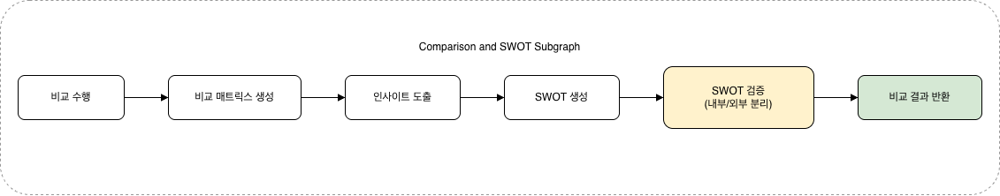

# Battery Strategy Multi-Agent System
전기차 캐즘 환경에서 LG에너지솔루션(LGES)과 CATL의 포트폴리오 다각화 전략을 비교 분석하고, 근거 기반 보고서를 자동 생성하는 LangGraph 기반 멀티 에이전트 시스템입니다.

## Overview
- Objective : EV 시장 둔화와 정책 불확실성 속에서 LGES와 CATL의 전략 차이, 리스크, 시사점을 구조적으로 분석합니다.
- Method : LangGraph 기반 Supervisor Orchestration, Agentic RAG, Web Augmentation, Bias Audit, HTML-to-PDF Reporting
- Tools : Python, LangGraph, OpenAI Responses API, FAISS, BM25, DDGS, Trafilatura, Playwright

## Features
- PDF 자료 기반 정보 추출 및 하이브리드 RAG 인덱싱
- 시장 분석, 기업 분석, 비교 분석, SWOT, 종합 시사점 자동 생성
- Supervisor 중심의 그래프 기반 멀티 에이전트 실행
- 시장, LGES, CATL 분석 병렬 수행 후 비교 단계로 결합
- RAG 우선 수집 후 부족한 축만 웹 검색으로 보강
- 검색 품질 필터링을 통한 저품질 출처, 쿠키 배너, 보일러플레이트 텍스트 제거
- 비교축 7개 고정 기반 비교 매트릭스 생성
- Markdown, HTML, PDF, final state 동시 산출
- 타임스탬프 기반 PDF 아카이빙
- 확증 편향 방지 전략 : Search Balance Checker, Bias Audit, 부분 재시도, retry history 중복 방지

## Tech Stack

| Category | Details |
|----------|---------|
| Framework | LangGraph, Python 3.11 |
| Orchestration | Custom Supervisor + StateGraph |
| LLM | OpenAI Responses API |
| Retrieval | FAISS, BM25, RRF |
| Embedding | BAAI/bge-m3 |
| Search | DDGS, Trafilatura |
| Parsing | pypdf |
| Reporting | Markdown, HTML/CSS, Playwright, ReportLab |
| CLI | Typer, Rich |

## Agents
- Supervisor Agent: 전체 상태를 관리하고 노드 실행 순서, 병렬 fan-out, 재시도 분기를 결정합니다.
- Market Analysis Agent: 시장 배경, 수요 변화, 정책, 공급망, 가격 환경을 분석합니다.
- Company Analysis Agent: LGES와 CATL의 포트폴리오, 상용화, 생산, 기술, 생태계, 리스크, 중장기 전략을 분석합니다.
- Comparison Agent: 7개 고정 비교축 기반 비교 매트릭스와 SWOT 초안을 생성합니다.
- Bias Audit Agent: 근거 부족, 출처 편중, 비교 누락, 반복 재시도 여부를 점검하고 재시도를 제안합니다.
- Writer Agent: 최종 Markdown, HTML, PDF 보고서와 참고문헌, final state를 생성합니다.

## Architecture



실제 실행에서는 Market, LGES, CATL 분석이 병렬로 수행되고, Bias Audit 결과에 따라 특정 축만 부분 재시도됩니다.

### Market Subgraph



시장 서브그래프는 시장 질의를 생성한 뒤 RAG와 웹 검색을 병행하고, 밸런스 점검을 거쳐 시장 배경과 핵심 근거를 정리합니다.

### Company Subgraph



기업 서브그래프는 LGES와 CATL 각각에 대해 질의 생성, RAG·웹 근거 수집, 품질 점검, 축별 프로파일 및 SWOT 입력 생성을 수행합니다.

### Comparison Subgraph



비교 서브그래프는 시장 맥락과 기업 분석 결과를 결합해 7개 고정 비교축 매트릭스를 만들고, Bias Audit 결과에 따라 필요한 경우 부분 재시도를 연결합니다.

## Directory Structure

```text
├── battery_strategy/
│   ├── agents/             # Market, Company, Comparison, Bias Audit, Writer, Supervisor
│   ├── rag/                # PDF 로딩, 청킹, 임베딩, 인덱싱, 검색
│   ├── tools/              # 프롬프트, 웹 검색, 밸런스 체크, LLM 래퍼
│   ├── utils/              # 타입, 설정, 공통 유틸
│   ├── cli.py              # Typer CLI 엔트리포인트
│   ├── graph.py            # LangGraph 그래프 정의
│   └── pipeline.py         # Runtime 조립 및 초기 상태 생성
├── configs/                # runtime 설정, manifest 경로
├── data/
│   └── raw/                # 원천 PDF 자료
├── outputs/                # final_report.md/html/pdf, final_state.json
├── tests/                  # 테스트 코드
├── visualize_graph.ipynb   # 그래프 시각화 실험 노트북
├── pyproject.toml          # 프로젝트 메타데이터 및 의존성
├── uv.lock                 # lockfile
└── README.md
```

## Contributors
- 김현문 : Prompt Engineering, Supervisor Graph Design, Bias Audit Logic
- 박동민 : PDF Parsing, Retrieval Pipeline, Web Search Augmentation
